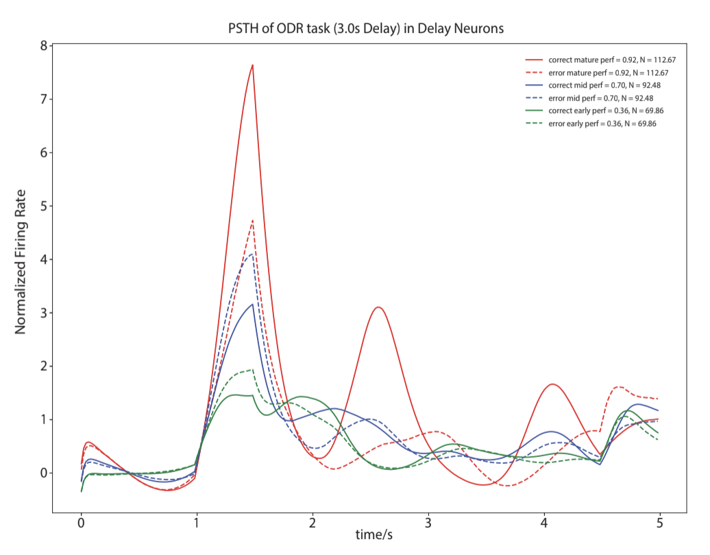
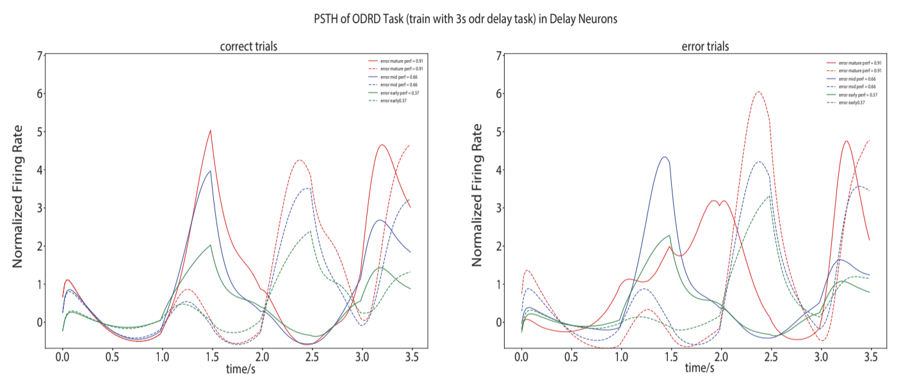
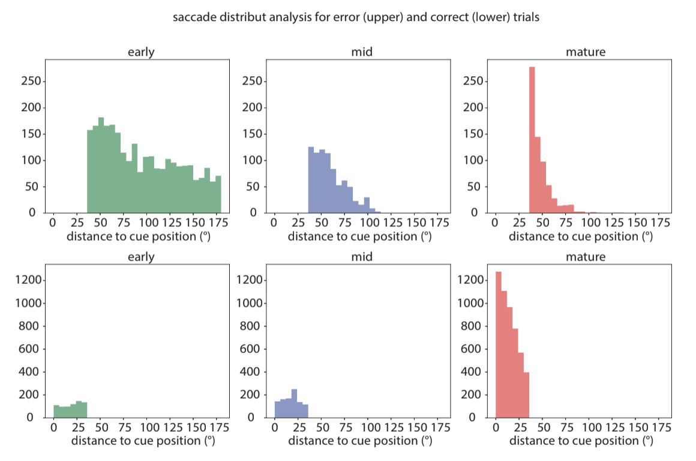
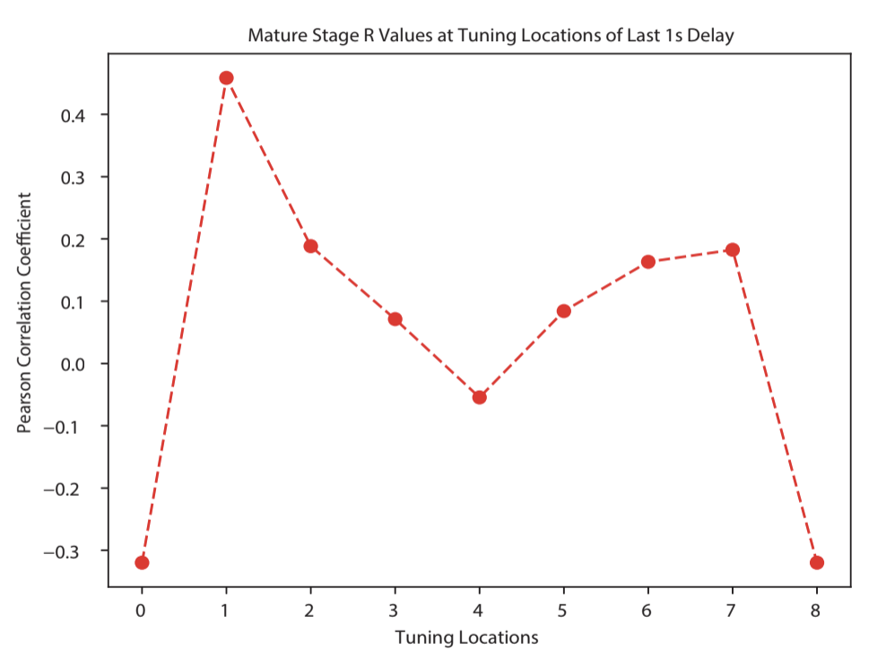
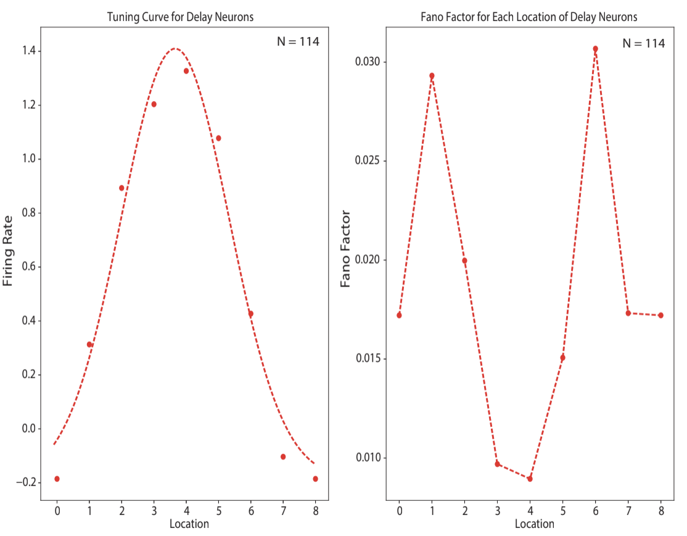
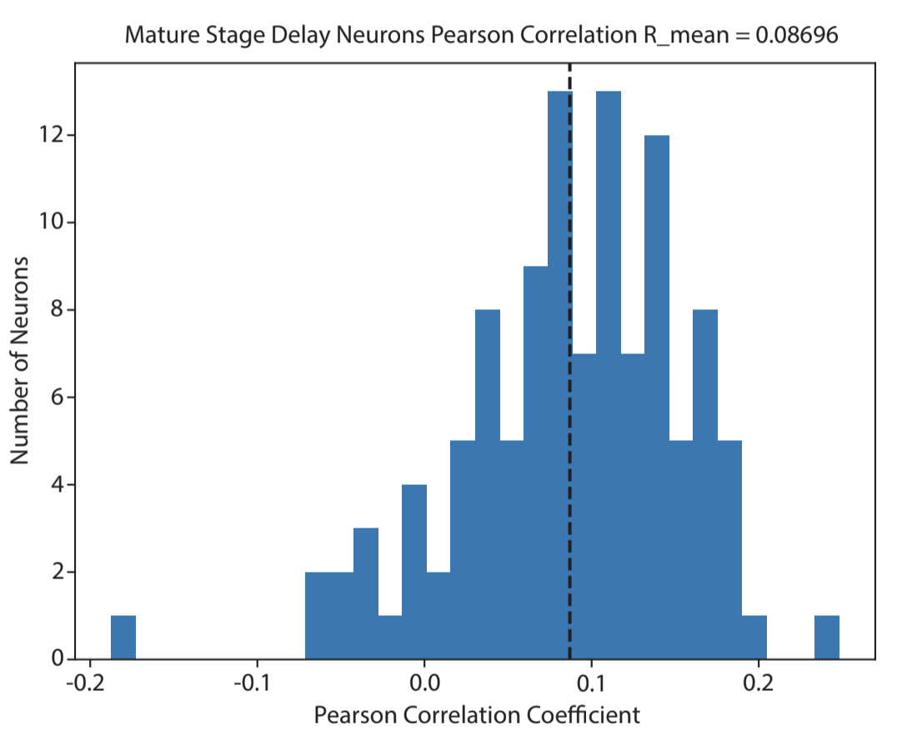
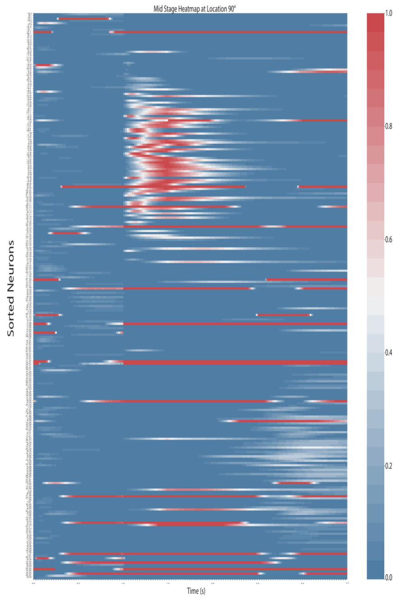
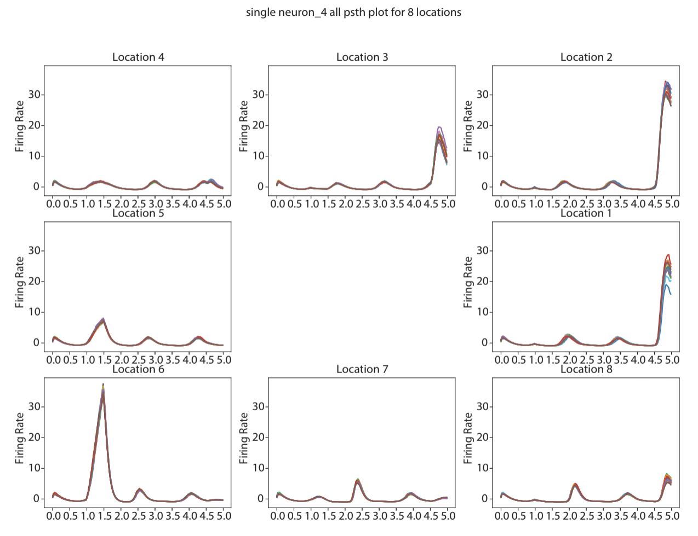
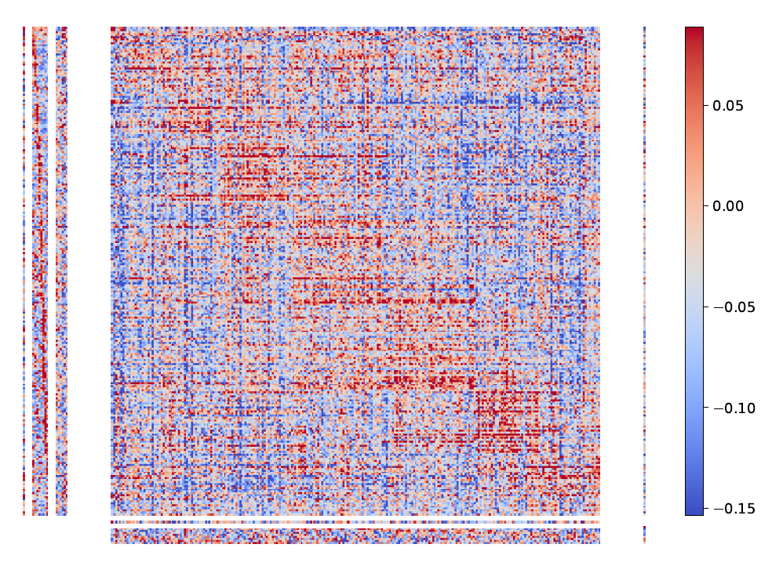

# RNN_workingmemoryaccuracy
## Dependencies
matplotlib, statsmodels, scipy, pandas, Tensorflow 1.15

## Colab
Here we also provide a jupyter notebook **Main_analysis.ipynb** that you can directly use in <a href="https://www.tutorialspoint.com/google_colab/google_colab_executing_external_python_files.htm">Google Colab</a> to train the models and perform some main analyses. 

*To use **Main_analysis.ipynb**, download "RNN_workingmemoryaccuracy" via git clone and save it in the google drive.

## Pretrained model
Model used in paper can be downloaded from <a href="https://zenodo.org/record/5209068#.YRrjz9NKi3I">here</a>

## Training

*Training scripts (including train.py, task.py and network.py) are partly adapted from* <a href="https://github.com/gyyang/multitask">Multitask</a> 

We train RNNs to learn working memory tasks (ODR 3s delay and ODRD) and anti-saccade tasks (Overlap, Zero-gap, and Gap/Gap500).

### File Structure

After training, files in */data* would be structured as follows:
```
├─data
   └─6tasks_8loc_256neuron_odr3000_seed0
      ├─hp.json                       -----> Hyperparameters              
      ├─log.json                      -----> Training logs
      ├─0
      │  ├─checkpoint                      ┐
      │  ├─model.ckpt.data-00000-of-00001  |
      │  ├─model.ckpt.index                |——Model saved
      │  └─model.ckpt.meta                 ┘
      ├─1280                          -----> Number of trails trained when saving the model, also noted as "trial number".
      │  ├─checkpoint                        We use it to distinguish models at different training stage.
      │  ├─model.ckpt.data-00000-of-00001
      │  ├─model.ckpt.index
      │  └─model.ckpt.meta
      │ ...
```
## Analysis
Most of the analysis in the paper can be reproduced by **Main_analysis.ipynb**.
### Main Analysis Function Instruction
**plot psth** plots mean rate of the RNN units responsive to the ODR task (upper) with 3s delay time and ODRD task (lower), during three developmental stages.
<p align="center">
	
</p>
<p align="center">
	
</p>

**endpoint_analysis** plots the distribution of saccade endpoints to the actual cue location, during three developmental stages.
<p align="center">
	
</p>

**Averaged_R_tuning_locs** plots pearson correlation coefficients at tuning locations of last 1s delay in mature stage.
<p align="center">
	
</p>

**single_neuron_fano_factor** plots tunning curves of RNN units in the delay period and fano factor for each location of delay neurons
<p align="center">
	
</p>

**R_distribution_dev_saccade_dev_fr** plots the distribution of pearson correlation coefficients between saccade deviation and firing rate deviation
<p align="center">
	
</p>

**neuron_heatmap** plots the heatmap of sorted neurons normalized firing rate (ascending order) at location 90° in mid stage network.
<p align="center">
	
</p>

**single_neuron_PSTH** plots the normalized PSTH of all correct trials at each location for single neuron in mature stage.
<p align="center">
	
</p>

**weight matrix** plots the weight matrices of input, output and recurrent weights in the network
<p align="center">
	
</p>
